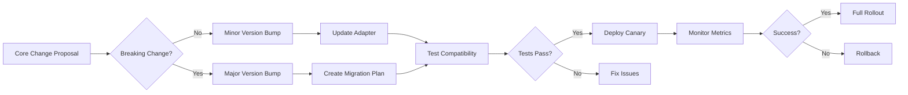

# 🔄 Safe Evolution Separation: ClawMore ↔ serverlessclaw

**Purpose:** Define architectural patterns and governance to ensure ClawMore (commercial platform) can evolve independently while maintaining compatibility with serverlessclaw (core technology).

---

## 🏗️ 1. Architectural Separation Principles

### **Core Principle: Dependency Inversion**

```
┌─────────────────────────────────────────────────────────────┐
│                    ClawMore Platform                         │
│  ┌─────────────┐  ┌─────────────┐  ┌─────────────┐         │
│  │   Billing   │  │  Dashboard  │  │  Onboarding │         │
│  └─────────────┘  └─────────────┘  └─────────────┘         │
│           │              │              │                   │
│           └──────────────┼──────────────┘                   │
│                          ▼                                  │
│              ┌─────────────────────┐                        │
│              │   Abstraction Layer │                        │
│              │   (Adapter Pattern) │                        │
│              └─────────────────────┘                        │
│                          │                                  │
└──────────────────────────┼──────────────────────────────────┘
                           │
                           ▼
              ┌─────────────────────────┐
              │   serverlessclaw Core   │
              │   (Versioned Interface) │
              └─────────────────────────┘
```

### **Separation Strategy**

| Layer                   | Responsibility                     | Evolution Rate     | Versioning |
| ----------------------- | ---------------------------------- | ------------------ | ---------- |
| **ClawMore Platform**   | Business logic, billing, dashboard | Fast (weekly)      | Semantic   |
| **Abstraction Layer**   | Interface contracts, adapters      | Slow (monthly)     | Contract   |
| **serverlessclaw Core** | Infrastructure, agents, mutations  | Medium (bi-weekly) | Semantic   |

---

## 🔌 2. Interface Contract System

### **Versioned API Contracts**

```typescript
// contracts/serverlessclaw-api-v1.ts
export interface ServerlessClawAPI {
  version: '1.0.0';

  // Core operations
  provisionClient(config: ClientConfig): Promise<ProvisionResult>;
  executeMutation(request: MutationRequest): Promise<MutationResult>;
  syncBlueprints(blueprint: Blueprint): Promise<SyncResult>;

  // Events
  on(event: 'mutation-completed', handler: MutationHandler): void;
  on(event: 'sync-failed', handler: ErrorHandler): void;
}

// contracts/serverlessclaw-api-v2.ts (Future)
export interface ServerlessClawAPI {
  version: '2.0.0';

  // Breaking changes:
  // - New required fields
  // - Deprecated methods removed
  // - Event payload changes
}
```

### **Contract Versioning Rules**

| Change Type            | Version Bump  | Migration Required | ClawMore Impact |
| ---------------------- | ------------- | ------------------ | --------------- |
| Add new optional field | Patch (1.0.1) | No                 | None            |
| Add new required field | Minor (1.1.0) | Yes (adapter)      | Low             |
| Remove/deprecate field | Major (2.0.0) | Yes (full)         | High            |
| Change event payload   | Major (2.0.0) | Yes (full)         | High            |

---

## 🛡️ 3. Safe Evolution Patterns

### **Pattern 1: Adapter Versioning**

```typescript
// clawmore/lib/adapters/serverlessclaw-v1.ts
export class ServerlessClawV1Adapter implements ServerlessClawAPI {
  version = '1.0.0' as const;

  async provisionClient(config: ClientConfig): Promise<ProvisionResult> {
    // Translate to v1 interface
    const v1Config = this.translateToV1(config);
    return this.core.provision(v1Config);
  }

  // Handle version differences gracefully
  private translateToV1(config: ClientConfig): V1ClientConfig {
    return {
      ...config,
      // Add v1-specific defaults
      legacyField: config.newField ?? 'default',
    };
  }
}

// clawmore/lib/adapters/serverlessclaw-v2.ts (Future)
export class ServerlessClawV2Adapter implements ServerlessClawAPI {
  version = '2.0.0' as const;

  // Handle new v2 interface
}
```

### **Pattern 2: Feature Flags for Core Integration**

```typescript
// clawmore/lib/config/features.ts
export const FEATURES = {
  USE_V2_MUTATION_API: process.env.USE_V2_MUTATION_API === 'true',
  ENABLE_NEW_SYNC_PROTOCOL: process.env.ENABLE_NEW_SYNC_PROTOCOL === 'true',
  HARVESTER_V2_ENABLED: process.env.HARVESTER_V2_ENABLED === 'true',
};

// Usage in platform code
if (FEATURES.USE_V2_MUTATION_API) {
  return this.adapterV2.executeMutation(request);
} else {
  return this.adapterV1.executeMutation(request);
}
```

### **Pattern 3: Canary Deployments**

```yaml
# clawmore/sst.config.ts (feature deployment)
const canaryPercentage = 10; // 10% of clients get new version

new sst.aws.Function('MutationHandler', {
  handler: 'functions/mutation.handler',
  environment: {
    SERVERLESSCLAW_VERSION: canaryPercentage > Math.random() * 100
      ? '2.0.0'
      : '1.0.0',
  },
});
```

---

## 🧪 4. Testing Strategy for Safe Evolution

### **Layered Testing Approach**

```
┌─────────────────────────────────────────┐
│           E2E Tests (ClawMore)          │
│  Test full platform with real core      │
└─────────────────────────────────────────┘
                    ▲
┌─────────────────────────────────────────┐
│      Integration Tests (Adapters)       │
│  Test adapter translation logic         │
└─────────────────────────────────────────┘
                    ▲
┌─────────────────────────────────────────┐
│         Contract Tests (Core)           │
│  Verify interface compatibility         │
└─────────────────────────────────────────┘
```

### **Contract Test Example**

```typescript
// tests/contracts/serverlessclaw-v1.test.ts
describe('serverlessclaw v1 contract', () => {
  it('should maintain backward compatibility', async () => {
    const adapter = new ServerlessClawV1Adapter();

    // Test all interface methods
    const result = await adapter.provisionClient({
      clientId: 'test-123',
      region: 'us-east-1',
    });

    // Verify response matches contract
    expect(result).toMatchObject({
      success: expect.any(Boolean),
      accountId: expect.any(String),
      // ... contract fields
    });
  });

  it('should handle v2 features gracefully', async () => {
    // Test that v1 adapter can handle v2 features
    // without breaking
  });
});
```

### **Compatibility Matrix Testing**

```typescript
// tests/compatibility/matrix.test.ts
const COMPATIBILITY_MATRIX = [
  { clawmore: '1.0.0', serverlessclaw: '1.0.0', expected: 'compatible' },
  { clawmore: '1.0.0', serverlessclaw: '1.1.0', expected: 'compatible' },
  { clawmore: '1.0.0', serverlessclaw: '2.0.0', expected: 'adapter-required' },
  { clawmore: '2.0.0', serverlessclaw: '1.0.0', expected: 'incompatible' },
];

describe('version compatibility', () => {
  COMPATIBILITY_MATRIX.forEach(({ clawmore, serverlessclaw, expected }) => {
    it(`clawmore ${clawmore} + serverlessclaw ${serverlessclaw} should be ${expected}`, async () => {
      const result = await testCompatibility(clawmore, serverlessclaw);
      expect(result.status).toBe(expected);
    });
  });
});
```

---

## 🚀 5. Evolution Governance

### **Change Control Process**



### **Version Lifecycle Management**

| Phase           | Duration  | Activities                            | Metrics             |
| --------------- | --------- | ------------------------------------- | ------------------- |
| **Development** | 1-2 weeks | Feature development, adapter creation | Code coverage       |
| **Testing**     | 1 week    | Contract tests, compatibility matrix  | Test pass rate      |
| **Canary**      | 3-7 days  | 10% traffic, monitor errors           | Error rate < 0.1%   |
| **Rollout**     | 1-2 days  | 100% traffic, monitor performance     | Latency P95 < 500ms |
| **Monitoring**  | Ongoing   | Track usage, gather feedback          | Adoption rate       |

### **Rollback Strategy**

```typescript
// clawmore/lib/evolution/rollback.ts
export class EvolutionRollback {
  async rollbackToVersion(version: string): Promise<void> {
    // 1. Identify affected clients
    const affectedClients = await this.getClientsOnVersion(version);

    // 2. Switch adapters
    await this.switchAdapter(version, 'previous');

    // 3. Notify clients (if needed)
    await this.notifyClients(affectedClients, 'rollback');

    // 4. Monitor for issues
    await this.monitorRollback(affectedClients);
  }

  private async switchAdapter(from: string, to: string): Promise<void> {
    // Feature flag or config update
    process.env.SERVERLESSCLAW_VERSION = to;
  }
}
```

---

## 📊 6. Evolution Metrics & Monitoring

### **Key Metrics for Safe Evolution**

| Metric                      | Purpose                          | Target    | Alert Threshold |
| --------------------------- | -------------------------------- | --------- | --------------- |
| **Adapter Coverage**        | % of core features with adapters | 100%      | < 95%           |
| **Contract Test Pass Rate** | Compatibility verification       | 100%      | < 98%           |
| **Canary Error Rate**       | Early failure detection          | < 0.1%    | > 0.5%          |
| **Migration Success Rate**  | Client upgrade success           | > 99%     | < 95%           |
| **Rollback Frequency**      | Stability indicator              | < 1/month | > 2/month       |

### **Evolution Dashboard**

```typescript
// clawmore/monitor/evolution-dashboard.ts
interface EvolutionMetrics {
  currentVersions: {
    clawmore: string;
    serverlessclaw: string;
    adapter: string;
  };

  compatibility: {
    matrix: CompatibilityResult[];
    warnings: string[];
    errors: string[];
  };

  clients: {
    total: number;
    byVersion: Record<string, number>;
    migrating: number;
    rolledBack: number;
  };
}
```

---

## 🎯 7. Implementation Roadmap

### **Phase 1: Foundation (Weeks 1-2)**

- [ ] Define `serverlessclaw` API contract v1.0.0
- [ ] Create adapter pattern implementation
- [ ] Add contract test suite
- [ ] Implement feature flag system

### **Phase 2: Governance (Weeks 3-4)**

- [ ] Establish change control process
- [ ] Create compatibility matrix tests
- [ ] Implement canary deployment system
- [ ] Add evolution monitoring dashboard

### **Phase 3: Automation (Weeks 5-6)**

- [ ] Automate adapter generation
- [ ] Implement rollback automation
- [ ] Add client migration tooling
- [ ] Create evolution reporting

### **Phase 4: Optimization (Ongoing)**

- [ ] Optimize adapter performance
- [ ] Improve contract test coverage
- [ ] Enhance monitoring and alerting
- [ ] Document best practices

---

## 🔐 8. Risk Mitigation

### **Risk Matrix**

| Risk                         | Probability | Impact   | Mitigation                       |
| ---------------------------- | ----------- | -------- | -------------------------------- |
| **Breaking change in core**  | Medium      | High     | Adapter pattern, feature flags   |
| **Client migration failure** | Low         | High     | Canary deployments, rollback     |
| **Performance degradation**  | Medium      | Medium   | Performance testing, monitoring  |
| **Security vulnerability**   | Low         | Critical | Security scanning, quick patches |

### **Contingency Plans**

1. **Emergency Rollback Procedure**
   - Switch to previous adapter version
   - Notify affected clients
   - Post-mortem analysis

2. **Client Communication Protocol**
   - Pre-migration notifications
   - Status page updates
   - Support escalation path

3. **Performance Degradation Response**
   - Automatic scaling
   - Traffic rerouting
   - Performance optimization sprint

---

## 📚 9. Documentation & Knowledge Base

### **Required Documentation**

- [ ] API Contract Specification (OpenAPI/Swagger)
- [ ] Adapter Development Guide
- [ ] Migration Runbook
- [ ] Troubleshooting Guide
- [ ] Best Practices Guide

### **Knowledge Sharing**

- Weekly evolution sync meetings
- Monthly architecture reviews
- Quarterly evolution retrospectives
- Annual strategy planning

---

**Document Status:** DRAFT  
**Last Updated:** April 2026  
**Owner:** ClawMore Architecture Team  
**Reviewers:** serverlessclaw Core Team
