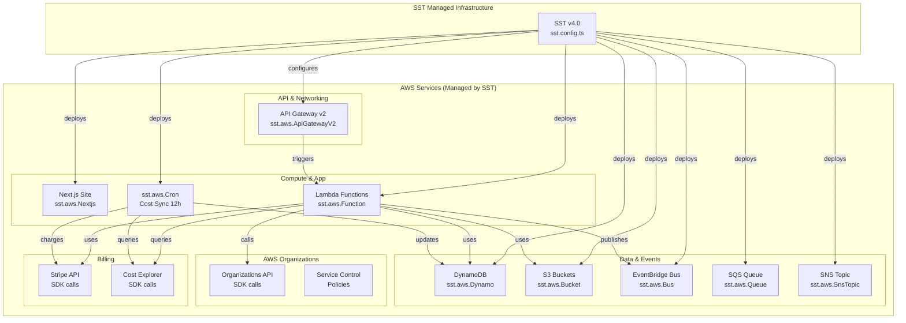

# ClawMore Profit-Readiness Plan

## Executive Summary

**Project:** ClawMore - Managed Serverless Agentic AWS Platform  
**Goal:** Prepare the project for commercial operation (profit generation)  
**Current State:** Beta/Waitlist mode with foundational infrastructure complete

---

## 1. Current State Assessment

### 1.1 What is ClawMore?

ClawMore is a managed serverless platform that:

- Creates managed AWS accounts for customers using AWS Organizations
- Applies Serverless-only Service Control Policies (SCPs) for governance
- Tracks AWS costs and bills customers for overages
- Uses EventBridge for agentic orchestration
- Provides an autonomous "evolution" system that can self-improve via Git

### 1.2 Business Model

| Tier      | Price                  | Features                             |
| --------- | ---------------------- | ------------------------------------ |
| Community | Free                   | Open source, self-hosted             |
| Managed   | $X/month + $1/mutation | Full managed service + Evolution Tax |

### 1.3 Architecture Overview

All infrastructure is managed by **SST (Serverless Stack)** via [`clawmore/sst.config.ts`](clawmore/sst.config.ts)

### Infrastructure Management Summary

| Component                | Manager              | Configuration File                                                   |
| ------------------------ | -------------------- | -------------------------------------------------------------------- |
| Next.js Web App          | SST                  | [`clawmore/sst.config.ts:131`](clawmore/sst.config.ts:131)           |
| Lambda Functions         | SST                  | [`clawmore/sst.config.ts:72,91,105`](clawmore/sst.config.ts:72)      |
| DynamoDB Tables          | SST                  | [`clawmore/sst.config.ts:28`](clawmore/sst.config.ts:28)             |
| S3 Buckets               | SST                  | [`clawmore/sst.config.ts:45`](clawmore/sst.config.ts:45)             |
| EventBridge Bus          | SST                  | [`clawmore/sst.config.ts:37`](clawmore/sst.config.ts:37)             |
| SQS Queue                | SST                  | [`clawmore/sst.config.ts:40`](clawmore/sst.config.ts:40)             |
| SNS Topics               | SST                  | [`clawmore/sst.config.ts:50`](clawmore/sst.config.ts:50)             |
| API Gateway              | SST                  | [`clawmore/sst.config.ts:58`](clawmore/sst.config.ts:58)             |
| Scheduled Cron Jobs      | SST                  | [`clawmore/sst.config.ts:113`](clawmore/sst.config.ts:113)           |
| AWS Organizations        | AWS SDK              | [`clawmore/lib/aws/vending.ts`](clawmore/lib/aws/vending.ts)         |
| Service Control Policies | AWS SDK              | [`clawmore/lib/aws/governance.ts`](clawmore/lib/aws/governance.ts)   |
| Stripe Billing           | AWS SDK + Stripe SDK | [`clawmore/lib/billing.ts`](clawmore/lib/billing.ts)                 |
| Cost Explorer            | AWS SDK              | [`clawmore/functions/cost-sync.ts`](clawmore/functions/cost-sync.ts) |

---

## 2. Security Vulnerabilities Found

### 2.1 Critical Issues

| Issue                     | File                  | Description                                            | Severity    |
| ------------------------- | --------------------- | ------------------------------------------------------ | ----------- |
| Hard-coded Admin Password | `clawmore/auth.ts:13` | Default password `clawmore-admin-2026` in code         | 🔴 Critical |
| Hard-coded Admin Email    | `clawmore/auth.ts:21` | `caopengau@gmail.com` hard-coded                       | 🔴 Critical |
| No Secrets Management     | Multiple              | Using env vars directly instead of AWS Secrets Manager | 🟠 High     |

### 2.2 Recommended Fixes

1. Move admin credentials to AWS Secrets Manager
2. Implement proper admin user management in DynamoDB
3. Add multi-factor authentication support
4. Add audit logging for admin actions

---

## 3. Billing/Payment Gaps

### 3.1 Current Implementation

- ✅ Basic Stripe integration (`clawmore/lib/billing.ts`)
- ✅ Metered usage reporting
- ✅ Overage charge handling
- ✅ Fuel pack checkout (pre-paid credits)

### 3.2 Missing Components

| Component               | Status     | Priority |
| ----------------------- | ---------- | -------- |
| Stripe Webhooks         | ❌ Missing | High     |
| Subscription Management | ⚠️ Partial | High     |
| Customer Portal         | ❌ Missing | Medium   |
| Invoice Generation      | ❌ Missing | Medium   |
| Promo Codes/Discounts   | ❌ Missing | Low      |
| Tax Calculation         | ❌ Missing | Medium   |

### 3.3 Required API Endpoints

- `POST /api/webhooks/stripe` - Handle Stripe events
- `GET /api/billing/portal` - Customer self-service portal
- `POST /api/billing/checkout` - Create subscription checkout

---

## 4. Production Readiness Gaps

### 4.1 Infrastructure

| Component       | Current  | Required                   | Priority |
| --------------- | -------- | -------------------------- | -------- |
| Rate Limiting   | ❌ None  | Add API Gateway throttling | High     |
| CDN/Edge        | ⚠️ Basic | CloudFront with WAF        | Medium   |
| SSL Certificate | ✅ Auto  | Already configured         | N/A      |
| DDoS Protection | ❌ None  | Add AWS WAF                | Medium   |

### 4.2 Observability

| Component      | Current       | Required                | Priority |
| -------------- | ------------- | ----------------------- | -------- |
| Error Tracking | ❌ Console    | Add Sentry/Datadog      | High     |
| Logging        | ⚠️ Basic      | Structured JSON logging | Medium   |
| Metrics        | ⚠️ CloudWatch | Custom business metrics | High     |
| Alerts         | ❌ None       | PagerDuty/OpsGenie      | High     |
| Dashboards     | ❌ None       | Grafana dashboards      | Medium   |

### 4.3 Reliability

| Component        | Current  | Required                   | Priority |
| ---------------- | -------- | -------------------------- | -------- |
| Backup/DR        | ❌ None  | Daily snapshots, DR region | High     |
| Health Checks    | ⚠️ Basic | Deep health checks         | Medium   |
| Circuit Breakers | ❌ None  | For external APIs          | Medium   |

---

## 5. Feature Completion Status

### 5.1 Implemented Features

All infrastructure managed by **SST v4.0** via [`clawmore/sst.config.ts`](clawmore/sst.config.ts):

| Feature           | File                                | Status         | Manager           |
| ----------------- | ----------------------------------- | -------------- | ----------------- |
| Lead Capture Form | `clawmore/components/LeadForm.tsx`  | ✅ Done        | Next.js           |
| Lead Storage (S3) | `clawmore/api/submit-lead.ts`       | ✅ Done        | SST + Lambda      |
| Admin Login       | `clawmore/app/admin/login/page.tsx` | ✅ Done        | NextAuth          |
| Leads Dashboard   | `clawmore/app/admin/leads/page.tsx` | ✅ Done        | Next.js           |
| Account Vending   | `clawmore/lib/aws/vending.ts`       | ✅ Done        | AWS SDK           |
| SCP Governance    | `clawmore/lib/aws/governance.ts`    | ✅ Done        | AWS SDK           |
| Cost Sync         | `clawmore/functions/cost-sync.ts`   | ✅ Done        | SST Cron + Lambda |
| Blog System       | `clawmore/app/blog/`                | ✅ Done        | Next.js           |
| Pricing Page      | `clawmore/app/ClawMoreClient.tsx`   | ⚠️ Placeholder | Next.js           |

### What's Already Implemented (SST-Managed Infrastructure)

| Component                  | Type      | Status     | Configuration                                          |
| -------------------------- | --------- | ---------- | ------------------------------------------------------ |
| Next.js Web App            | Compute   | ✅         | [`sst.config.ts:131`](clawmore/sst.config.ts:131)      |
| DynamoDB (User Data)       | Database  | ✅         | [`sst.config.ts:28`](clawmore/sst.config.ts:28)        |
| S3 (Leads)                 | Storage   | ✅         | [`sst.config.ts:45`](clawmore/sst.config.ts:45)        |
| EventBridge Bus            | Events    | ✅         | [`sst.config.ts:37`](clawmore/sst.config.ts:37)        |
| SQS Queue                  | Queue     | ✅         | [`sst.config.ts:40`](clawmore/sst.config.ts:40)        |
| SNS (Notifications)        | Pub/Sub   | ✅         | [`sst.config.ts:50`](clawmore/sst.config.ts:50)        |
| API Gateway                | API       | ✅         | [`sst.config.ts:58`](clawmore/sst.config.ts:58)        |
| Lambda Functions           | Compute   | ✅         | [`sst.config.ts:72,91,105`](clawmore/sst.config.ts:72) |
| Scheduled Cron (Cost Sync) | Scheduler | ✅         | [`sst.config.ts:113`](clawmore/sst.config.ts:113)      |
| Stripe Integration         | Billing   | ✅ Partial | [`lib/billing.ts`](clawmore/lib/billing.ts)            |

### 5.2 Missing Features

| Feature                       | Priority | Complexity |
| ----------------------------- | -------- | ---------- |
| User Signup/Registration      | High     | Medium     |
| Subscription Checkout Flow    | High     | Medium     |
| Stripe Webhooks               | High     | Low        |
| Customer Dashboard            | High     | High       |
| Self-serve Account Management | Medium   | High       |
| Usage Analytics               | Medium   | Medium     |
| Email Notifications           | Medium   | Low        |

---

## 6. Recommended Roadmap

### Phase 1: Security Hardening (Week 1-2)

- [ ] Move admin credentials to AWS Secrets Manager
- [ ] Implement proper admin user management
- [ ] Add rate limiting to API endpoints
- [ ] Add WAF protection

### Phase 2: Payment Integration (Week 2-3)

- [ ] Implement Stripe webhook handler
- [ ] Create subscription checkout flow
- [ ] Build customer portal
- [ ] Add invoice generation

### Phase 3: Evolution Separation (Week 3-4)

- [ ] Define serverlessclaw API contract v1.0.0
- [ ] Create adapter pattern implementation
- [ ] Add contract test suite
- [ ] Implement feature flag system for core integration
- [ ] Establish compatibility matrix testing

### Phase 4: Observability (Week 4-5)

- [ ] Add error tracking (Sentry)
- [ ] Implement structured logging
- [ ] Create business metrics dashboard
- [ ] Set up alerting
- [ ] Add evolution monitoring dashboard

### Phase 5: User Features (Week 5-6)

- [ ] User registration flow
- [ ] Customer dashboard
- [ ] Usage reporting
- [ ] Email notifications

### Phase 6: Launch Prep (Week 6-7)

- [ ] Documentation
- [ ] Terms of Service
- [ ] Privacy Policy
- [ ] Launch marketing
- [ ] Evolution separation documentation

---

## 7. Immediate Actions Required Before Production

### 7.1 Must Fix Before Launch

1. Remove hard-coded credentials
2. Implement Stripe webhooks
3. Add error tracking
4. Set up backups

### 7.2 Should Fix Before Launch

1. Add rate limiting
2. Implement customer portal
3. Add usage dashboards

### 7.3 Nice to Have

1. Multi-factor authentication
2. Custom domain with CDN
3. Advanced analytics

---

## 8. Technical Debt

| Item                      | Description                    | Effort |
| ------------------------- | ------------------------------ | ------ |
| Hard-coded URLs           | Domain URLs in multiple places | Low    |
| Missing TypeScript strict | Some files need better typing  | Medium |
| E2E Tests                 | Only 2 test files exist        | High   |
| API Documentation         | No OpenAPI spec                | Medium |

---

## 9. Summary

ClawMore has a solid foundation with:

- ✅ Core infrastructure (AWS account vending, governance, cost tracking)
- ✅ Frontend web app with lead capture
- ✅ Blog system
- ✅ Admin dashboard
- ✅ Basic Stripe integration

Key gaps for profit-readiness:

- 🔴 Security (hard-coded credentials)
- 🟠 Payment flow (missing webhooks, subscriptions)
- 🟡 Observability (logging, metrics, alerts)
- 🟡 User features (signup, dashboard)

**Estimated effort:** 6 weeks for production-ready launch
